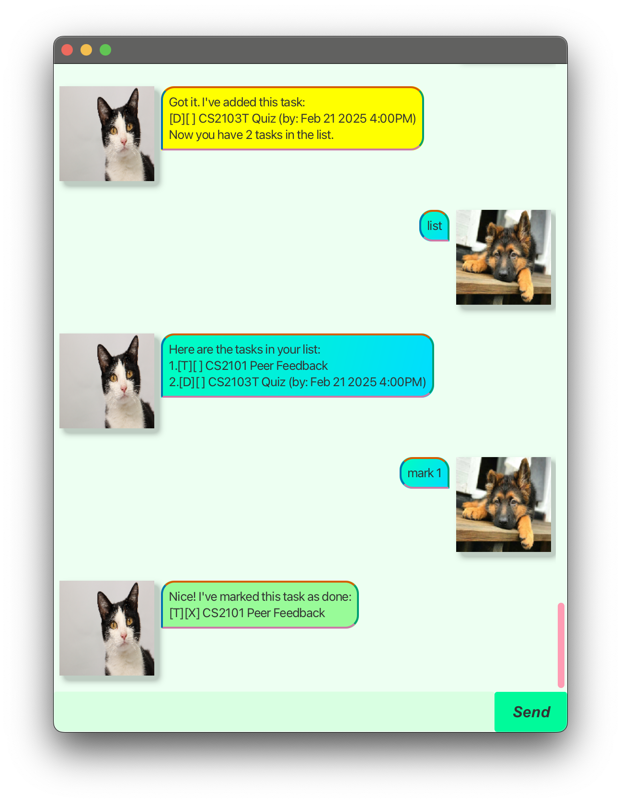

# Ricky User Guide



Ricky is a chatbot designed to help you remember tasks efficiently. With simple commands, you can add, mark, delete, 
and list tasks easily.

## Getting Started
1. Download the latest version of Ricky from the releases page.
2. Run the jar file using the following command:
    ```
    java -jar ricky.jar
    ```
3. Start typing in the text box to interact with Ricky!

## Listing Tasks

Displays all tasks in the task list.

Example: `list`

```
Here are the tasks in your list:
1. [T][ ] Buy groceries
2. [D][ ] Assignment (by: 2024-12-01 23:59)
3. [E][ ] Meeting (from: 2024-12-02 14:00 to: 2024-12-02 16:00)
```

## Adding a Todo Task

Adds a todo task to the task list.

Example: `todo Buy groceries`

```
Got it. I've added this task:
[T][ ] Buy groceries
Now you have 1 task in the list.
```


## Adding a Deadline Task

Adds a deadline task to the task list.

Example: `deadline Assignment /by 2024-12-01 23:59`

```
Got it. I've added this task:
[D][ ] Assignment (by: 2024-12-01 23:59)
Now you have 2 tasks in the list.
```

## Adding an Event Task

Adds an event task to the task list.

Example: `event Meeting /at 2024-12-02 14:00 to 2024-12-02 16:00`

```
Got it. I've added this task:
[E][ ] Meeting (from: 2024-12-02 14:00 to: 2024-12-02 16:00)
Now you have 3 tasks in the list.
```

## Marking a Task as Done

Marks a task as done in the task list.

Example: `mark 1`

```
Nice! I've marked this task as done:
[T][X] Buy groceries
```

## Marking a Task as Undone

Marks a task as undone in the task list.

Example: `unmark 1`

```
OK, I've marked this task as not done yet:
[T][ ] Buy groceries
```

## Deleting a Task

Deletes a task from the task list.

Example: `delete 1`

```
Noted. I've removed this task:
[T][ ] Buy groceries
Now you have 2 tasks in the list.
```

## Finding Tasks

Finds tasks that contain the given keyword.

Example: `find Assignment`

``` 
Here are the matching tasks in your list:
1. [D][ ] Assignment (by: 2024-12-01 23:59)
``` 

## Exiting the Program

Exits the program.

Example: `bye`

``` 
Bye. Hope to see you again soon!
```

## Saving Data

Ricky automatically saves your tasks to a local file. You can access your tasks even after closing the program.

## Command Summary

| Action | Format, Examples |

|--------|------------------|

| List | `list` |

| Todo | `todo DESCRIPTION`, e.g. `todo Buy groceries` |

| Deadline | `deadline DESCRIPTION /by DATE_TIME`, e.g. `deadline Assignment /by 2024-12-01 23:59` |

| Event | `event DESCRIPTION /at START_DATE_TIME to END_DATE_TIME`, e.g. `event Meeting /at 2024-12-02 14:00 to 2024-12-02 16:00` |

| Mark as Done | `mark INDEX`, e.g. `mark 1` |

| Mark as Undone | `unmark INDEX`, e.g. `unmark 1` |

| Delete | `delete INDEX`, e.g. `delete 1` |

| Find | `find KEYWORD`, e.g. `find Assignment` |

| Exit | `bye` |

## Acknowledgements

This project is based on the Duke project created by the [SE-EDU initiative](https://se-education.org/).
``